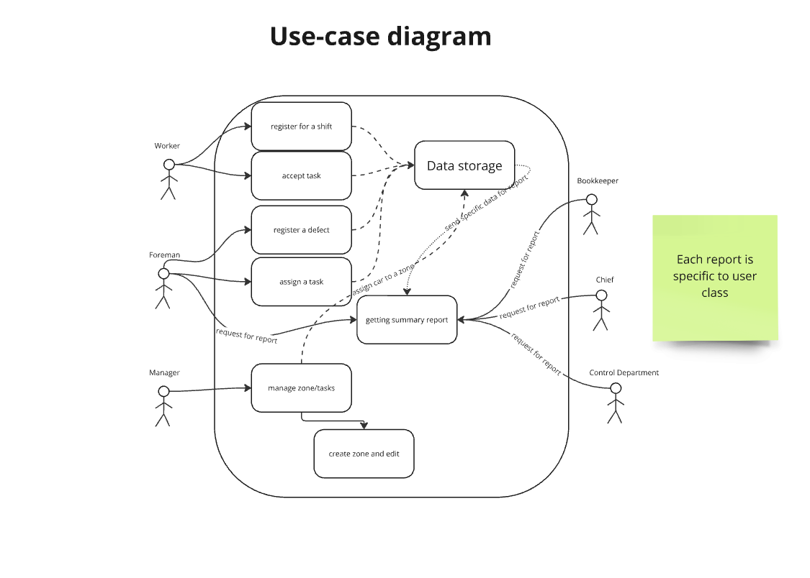
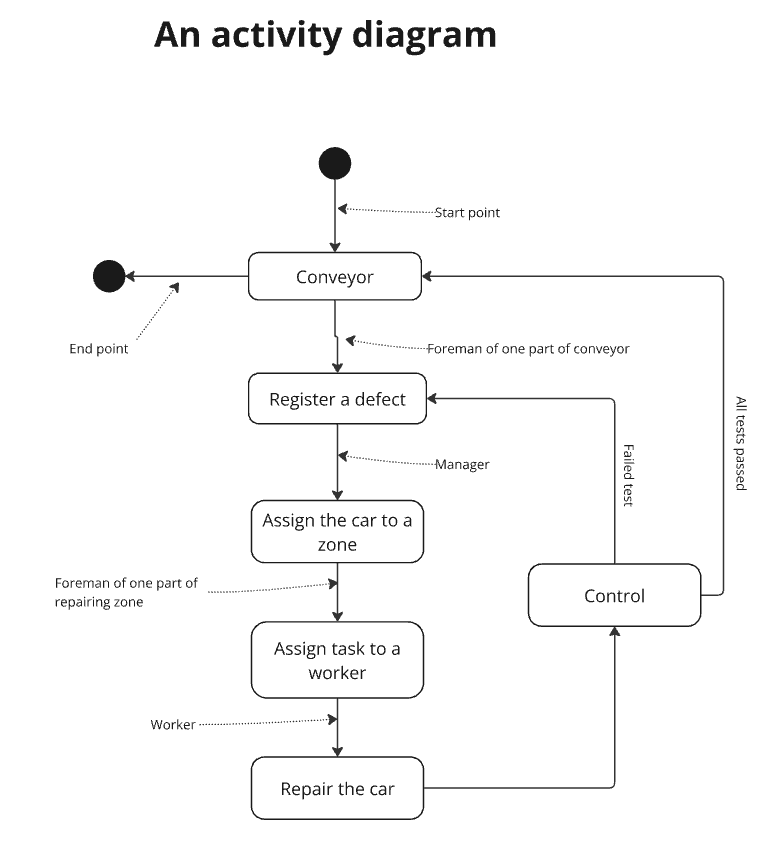
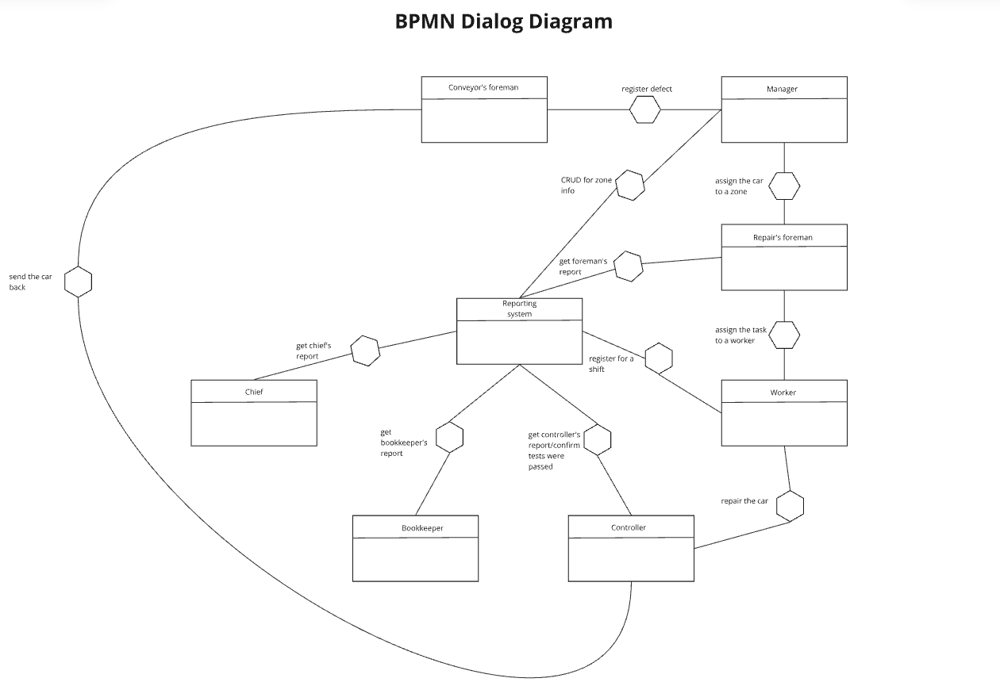

# Requirement analysis

### Identified inaccuracies in requirements

* Who is in charge of detecting defects on a conveyer? 

    A foreman? A worker? A manager?
* Brigades are told to work in shifts on the same repairing zone. What happens if a brigade can't finish the repairment until the end
of the shift? Will they stay attached to the zone until the end or not?

* What if a defect requires work of two workers? For now, only one can be assigned for a task. And how to compute their metrics then?

### 1.

### 2.

### 3.

